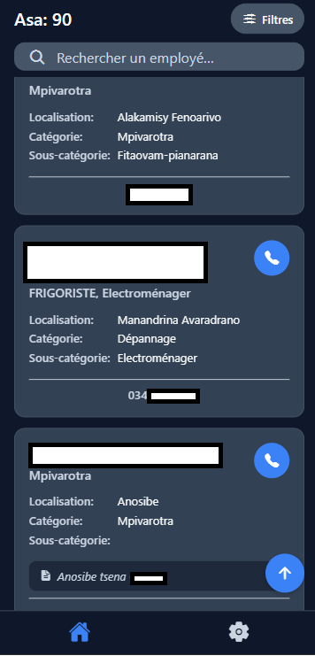
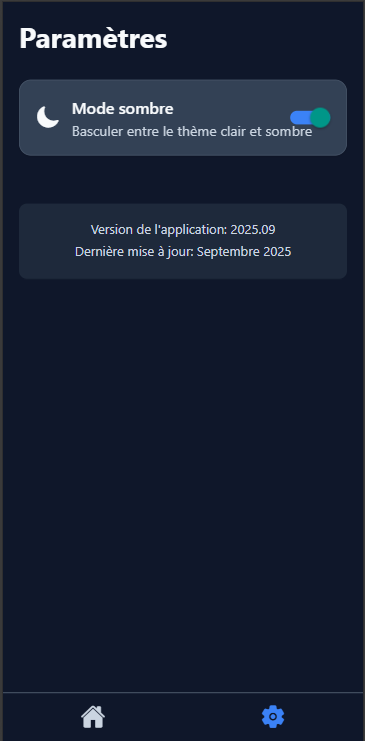

# 📱 ZASPAIM – Miantsena App

**ZASPAIM Miantsena** is a mobile app built with **React Native + Expo + Firebase** to manage employees grouped by custom categories.

---

## 🧭 Navigation

* **Employees Screen**: View employees grouped by category
* **Settings**: Theme switcher, sync toggle, logout button

---

## 🛠 Tech Stack

* **React Native** (via [Expo](https://expo.dev/))
* **React Navigation**
* **AsyncStorage**
* Optional backend: Firebase, Supabase, etc.

---

## 🚀 Getting Started

1. **Install dependencies**

   ```bash
   npm install
   ```

2. **Start Expo**

   ```bash
   npx expo start
   ```

3. **Run on device**
   Scan the QR code from the Expo Go app.

---

## 📸 Screenshots

| Accueil | Settings                        |
| ----------------------------------- |------------------------------- |
|  |  |

---

## 🧑‍💼 Author

Developed by **Vana-IT**  
[Contact via Email](mailto:sandratriniavotiavinaeric@gmail.com)
```bash
sandratriniavotiavinaeric@gmail.com
```